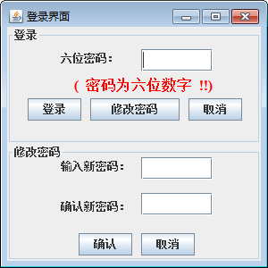
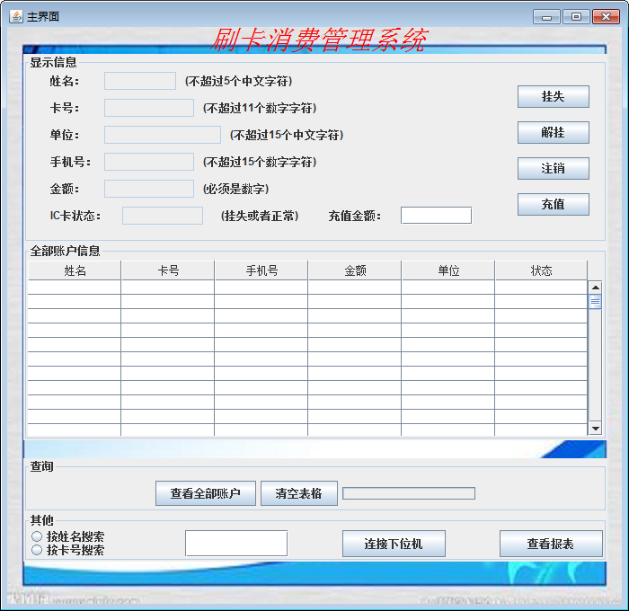

### 校园卡刷卡消费系统上位机：
  这个小项目是我毕业设计的作品，这是上位机部分的java代码，下面就各部分做一下简单介绍：

#### 1. 开发环境

  java代码基于Eclipse开发环境（**切记使用JDK1.8以下的版本进行开发，我使用的是JDK1.7**），数据库是SQL Server 2008,消费报表部分是利用的DynamicReports插件，这个动态报表需要添加一部分复杂的第三方包，在我的CSDN的博客有介绍,下面附上链接：
<http://blog.csdn.net/wang975380547>，另外当时用MSP430单片机和GSM模块没有调出来下位机发送报警短信，所以改用上位机用java的RXTX.jar包来进行串口通信。

#### 2. 项目目录介绍
 
  （1）bin文件夹里面有一个fanka.jpg的图片，是我的上位机系统的背景页面，就让它呆在这里就好了，没有这个图片会报错。

  （2）Required third party package文件夹里面主要包含的是DynamicReports所需要的jar包、Server 2008需要的驱动包、串口通信的RXTX.jar包
  (**这个添加第三方包的时候注意一下路径就OK了**)。

  （3）src文件夹里面放的java源码：

   1. Card-Management-System是系统的登录界面，在数据库里面专门有一个表用来更新登录密码，你可以进行修改密码的操作。如下图：

  
 
   2. HomeScreen就是系统的主操作界面了，当没有人贴上卡时，你可以进行查询全部用户、按姓名和学号查找等操作；当你按下连接下位机的按钮，就可以进行刷卡消费了，当下位机识别到卡号，将数据通过wifi上传上位机并在数据库内部进行已存卡号匹配，然后将对应信息显示在相应位置，之后就可以进行其他的诸如充值、注销、挂号等操作，还可以打印消费报表，主界面如下图：

  

   3. 其它的文件夹就分别放着串口通信通过GSM发送报警短信、数据库操作、生成pdf动态报表的相应代码的操作。

   4. 另外关于数据库的相关文件，比如建表文件的问题等可以通过issues来和我交流，或者通过我的邮箱：wangzhonghua_cnu@163.com来与我联系。

#### 3. 功能

   1. 具有一般的充值、扣费、注销、挂失功能

   2. 通过**JDBC**链接数据库

   3. 数据库用的是**SQL-Server-2008**

   4. 使用**Jasperreports**插件**DynamicReports**生成PDF版的消费报表

   5. 使用EMW3162的WIFI模块与下位机进行通信

   6. 通过JAVA的**RXTX.jar**串口包实现**GSM模块**发送校园卡**盗刷报警**短信给持卡用户
  

#### 提示：

   1. 下位机的相关代码与硬件设计（PCB文件也有哦）**请看我的另一个Repository：**  [Repositoty](https://github.com/TeslaHua/CampusCardConsumptionSystem-Hardware)。
   2. 这个小项目适合做本科毕业设计或者课程设计的参考。
   3. 请大家多多指教，多多交流，多谢 ！
